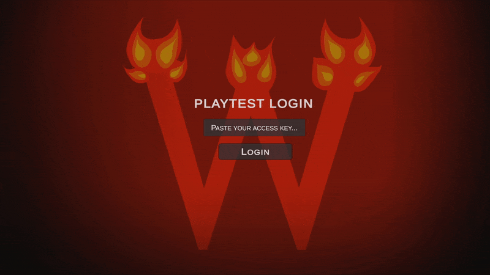

# 🎮Playtesters.API

**Playtesters.API** is a lightweight, secure RESTful service built with **.NET 8** and **Entity Framework Core (SQLite)**.

It’s designed for indie developers or small teams who need a simple way to manage **playtesters**, **access keys**, and **access validation history** for private or early-access game builds.

> This project was created to support the roguelike action game I'm building with my best friend from school.

## ✨Features

- Create and manage tester accounts with unique access keys (GUIDs).
- Track successful access validations with timestamp and IP address.
- Filter and inspect tester access history by country for better monitoring and detection of shared access keys.
- Built-in IP geolocation system powered by ip-api.com, with caching to minimize API calls and improve performance.
- Secure admin endpoints using an API key stored in `.env`.
- Public endpoint for game clients to validate access keys.
- Public endpoint to report and accumulate playtime, allowing game clients to increment hours played.
- Easy to integrate with Unity or any custom launcher/client.
- Organized structure using use cases, services, DTOs, validators, and minimal APIs.

## 🧰Tech Stack
- [.NET 8 (Web API)](https://dotnet.microsoft.com/en-us/download/dotnet/8.0)
- [Entity Framework Core (SQLite)](https://www.nuget.org/packages/Microsoft.EntityFrameworkCore.Sqlite)
- [Swashbuckle (Swagger)](https://github.com/domaindrivendev/Swashbuckle.AspNetCore)
- [FluentValidation](https://github.com/FluentValidation/FluentValidation)
- [SimpleResults](https://github.com/DevD4v3/SimpleResults)
- [DotEnv.Core](https://github.com/DevD4v3/dotenv.core)
- [NUnit](https://github.com/nunit/nunit)
- [FluentAssertions V7](https://github.com/fluentassertions/fluentassertions)

## 🚀 Getting Started

### Running the API locally (.NET CLI)
- Install [.NET 8 SDK](https://dotnet.microsoft.com/en-us/download/dotnet/8.0).
- Navigate to the project directory:
```bash
cd src
```
- Create a `.env` file:
```.env
API_KEY=your-admin-key
SQLITE_DATA_SOURCE=playtesters.db
```
- Run the API:
```bash
dotnet run
```
- Access the application with this URL:
```
http://localhost:5183/swagger
```

### Running with Docker

- Build the Docker image from the root of the repo:
```bash
docker build -t playtesters-api .
```
- Run the container without persistence (only for testing):
```bash
docker run -p 5183:8080 --env-file .env playtesters-api
```

If you want the `playtesters.db` file to persist across restarts:
- Run the container with a mounted volume:
```bash
docker run \
  -p 5183:8080 \
  --env-file .env \
  -v playtesters_data:/app/data \
  playtesters-api
```
- Make sure your connection string points to:
```bash
SQLITE_DATA_SOURCE=/app/data/playtesters.db
```
When the application starts, EF Core automatically applies the migrations and creates the SQLite database (along with its schema) inside the path `/app/data`.
This is important because the database file is generated at runtime, meaning the container writes it into the mounted volume.
By doing this, the volume does not overwrite the database path with an empty directory — instead, it simply persists the file that the app creates.

## 🔐Authentication

All admin endpoints require the following header:
```http
X-Api-Key: <your-admin-key>
```
The admin key must be defined in your `.env` file:
```.env
API_KEY=your-admin-key
```

Only the endpoint `/api/testers/validate-access` is publicly accessible for validating tester access, and `/api/testers/{accessKey}/playtime` is publicly accessible for reporting accumulated playtime.

## 🎮Unity Integration

- The `/api/testers/validate-access` endpoint should be called before allowing gameplay or enabling private build features to ensure the tester has valid access.

- The `/api/testers/{accessKey}/playtime` endpoint can be called anytime during or after gameplay to report accumulated playtime for the tester.
### Unity Login Flow Demo

Below is a quick demonstration of how you can integrate the Playtesters API into a Unity login screen using a simple access key workflow.



## 📘 HTTP Request Examples

You can use this [Playtesters.API.http](https://github.com/DevD4v3/Playtesters.API/blob/master/src/Playtesters.API.http) file (VS Code / Rider / Visual Studio compatible) to test every endpoint of the API.

## 📄License

MIT License — feel free to use, modify, and extend it for your own projects.
